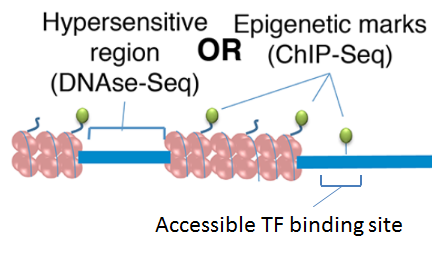
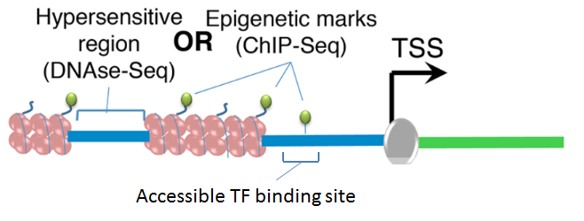
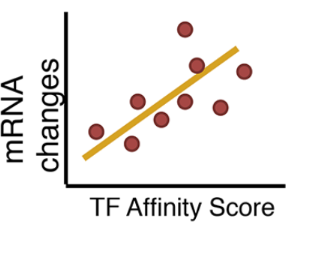

[](https://travis-ci.org/fraenkel-lab/GarNet)

# GarNet

Many biological labs commonly use RNA-seq or other high-throughput technologies to assess the gene expression changes in their experimental systems. In order to produce these gene expression changes, regulatory machinary in the cell must have caused changes in transcription. Assessing the effect of each factor of this regulatory machinary directly is often difficult. An open question, then, is how to use gene expression data to predict which cis-regulatory elements, such as transcription factor proteins, were at play in producing those gene expression changes.

The goal of GarNet is to use gene expression and epigenetic data to impute transcription factors (TFs) that played an important role in a biological system. Transcription factors bind in open chromatin regions to specific DNA sequences called "motifs," and affect the expression levels of nearby genes.
To determine which TFs were relevant to a biological system, users should supply epigenetic regions (peaks) of interest (i.e. open chromatin regions derived from ATAC-seq or DNase-seq on your cells or in a similar cell line) and differential gene expression data. GarNet:

1. Looks for known TF motifs (derived from [MotifMap](http://motifmap-rna.ics.uci.edu/)) that occur within your epigenetic regions.

2. Looks for known genes (derived from [RefSeq](https://www.ncbi.nlm.nih.gov/refseq/)) that occur near your epigenetic regions.

3. Maps the TFs and genes that were found near the same peaks to each other as those TFs potentially effect the expression of those genes
4. For each TF, uses linear regression to see if the change in expression level is dependent on the strength of the Transcription factor binding motif.



If a Transcription Factor binding motif is found near genes changing in expression, inside relevant epigenetic regions in this tissue type, and changes in gene expression are significantly dependent on the strength of that motif, we predict that the TF is likely an important player in the gene expression in your system. We assign a score to that TF based on the significance and slope of the regression of motif strength on gene expression.


## Setup

GarNet is a python3 package [available via pypi](https://pypi.python.org/pypi/GarNet). So a simple

```
pip3 install garnet
```
```
from GarNet import *
```

should suffice. GarNet depends on numpy, pandas, statsmodels, and [IntervalTree](https://github.com/chaimleib/intervaltree). (and matplotlib and jinja2 for figures and reports)


## Documentataion

GarNet has 2 public methods:

- **`map_peaks`** which finds local groups of TF binding motifs, genes, and peaks.
- **`TF_regression`** which, given a set of motif-gene-peak complexes (e.g. from the previous function) and a gene expression profiles (e.g. from RNA-Seq), will perform regression to predict the significance of each transcription factor to the expression profile.


[Specific documentation about each of the functions can be found here.](https://fraenkel-lab.github.io/GarNet/html/index.html)


## Acknowledgements

This repository is an updated version of Garnet, originally written by [Sara Gosline](https://github.com/sgosline) and Anthony Soltis as part of [OmicsIntegrator](https://github.com/fraenkel-lab/omicsintegrator).

This repository depends heavily on [pandas](http://pandas.pydata.org/) and [IntervalTree](https://github.com/chaimleib/intervaltree).

We're very thankful for access to [MotifMap](http://motifmap-rna.ics.uci.edu/) and [RefSeq](https://www.ncbi.nlm.nih.gov/refseq/) for our motif and genome data, upon which our analyses depend.


